# Final Task 6 - MongoDB Practice

In this task we utilize and learned the MongoDB program, Using the given guide step-by-step by our Instructor.

## MongoDB Database

## Queries

  1. Get all documents.   Code: <code>db.movies.find()</code>

  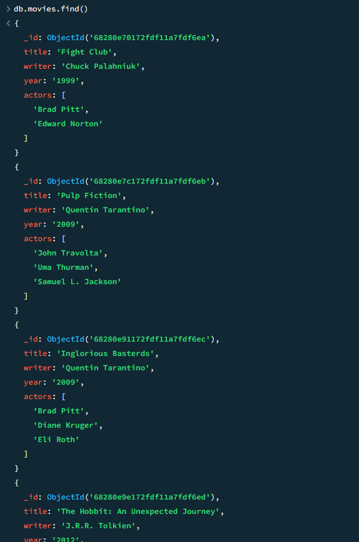

  2. Get all documents with "Writer" set to "Quentin Tarantino".   Code: <code>db.movies.find({writer:"Quentin Tarantino"})</code>

  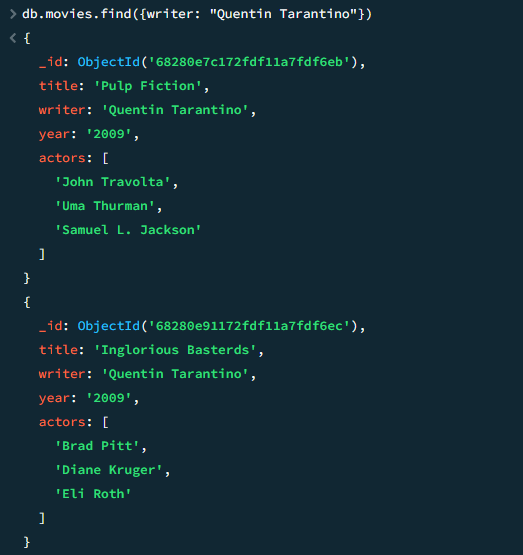

  3. Get all documents where "actor" includes Brad Pitt.   Code: <code>db.movies.find({actors:"Brad Pitt"})</code>

  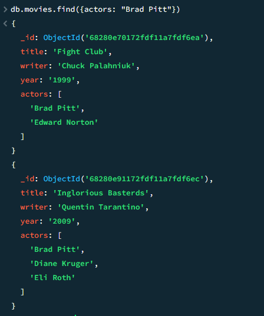

  4. Get all documents with "Franchise" set to "The Hobbit".   Code: <code>db.movies.find({franchise:"The Hobbit"})</code>

  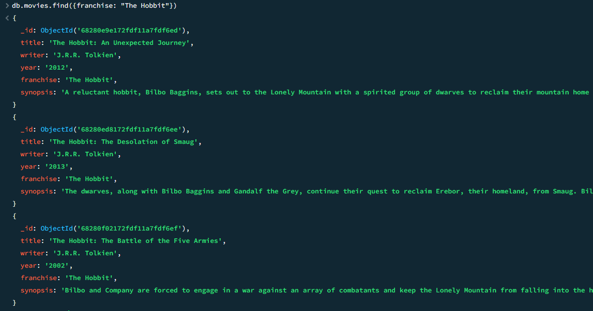

  5. Get all movies released in the 90s.   Code: <code>db.movies.find({year:{$gt:"1990", $lt:"2000"}})</code>

  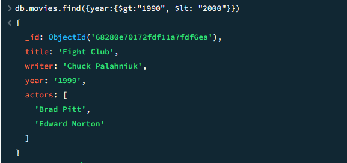

  6. Get all movies released before the year 2000 or after 2010.   Code: <code>db.movies.find({$or:[{year:{$gt:"2010"}},{year: {$lt:"2000"}}]})</code>

  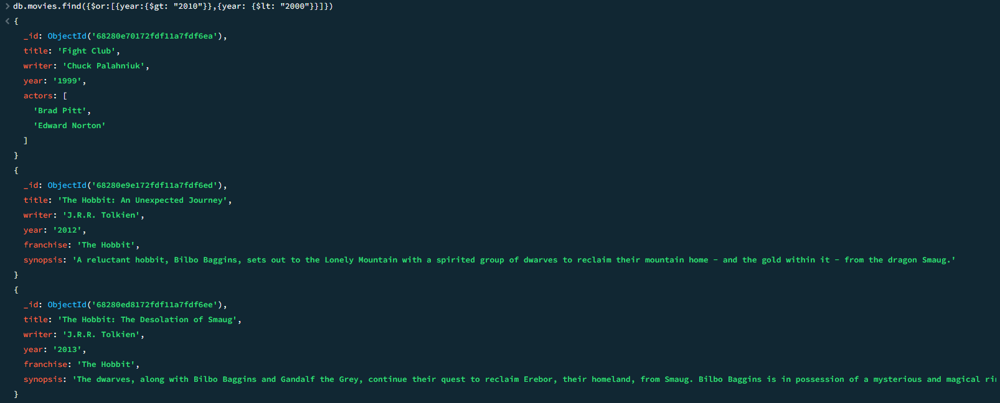

## Documents Update

  1. Add a synopsis to "The Hobbit An Unexpected Journey": "A reluctant hobbit, Bilbo Baggins, sets out to the Lonely Mountain with a spirited group of dwarves to reclaim their mountain home and the gold within it - from the dragon Smaug."

  Code: <code>db.movies.update({title: "The Hobbit An Unexpected Journey"}, {$set: {synopsis: "A reluctant hobbit, Bilbo Baggins, sets out to the Lonely Mountain with a spirited group of dwarves to reclaim their mountain home and the gold within it - from the dragon Smaug."}})</code>

  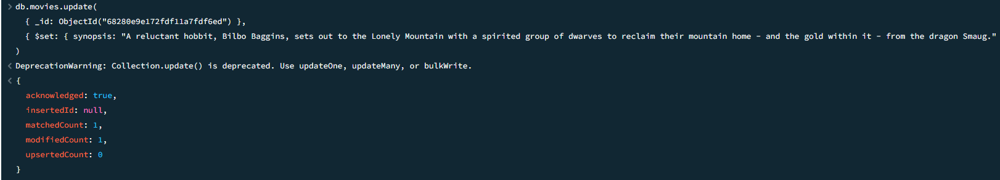

  After Update:

  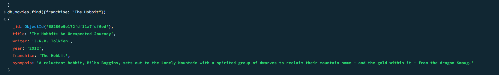

  2. Add a synopsis to "The Hobbit: The Desolation of Smaug": "The dwarves, along with Bilbo Baggins and Gandalf the Grey, continue their quest to reclaim Erebor, their homeland, from Smaug. Bilbo Baggins is in possession of a mysterious and magical ring."

  Code: <code>db.movies.update({title: "The Hobbit: The Desolation of Smaug"}, {$set: {synopsis: "The dwarves, along with Bilbo Baggins and Gandalf the Grey, continue their quest to reclaim Erebor, their homeland, from Smaug. Bilbo Baggins is in possession of a mysterious and magical ring."}})</code>

  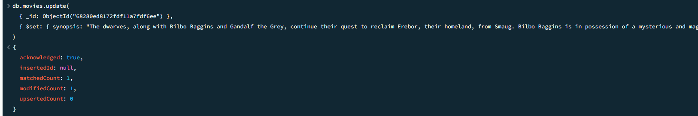

  After Update:

  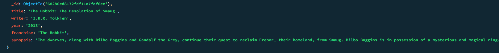

  3. Add an actor named "Samuel L. Jackson" to the movie "Pulp Fiction"

  Code: <code>db.movies.update({title: "Pulp Fiction"}, {$push: {actors: "Samuel L. Jackson"}})</code>

  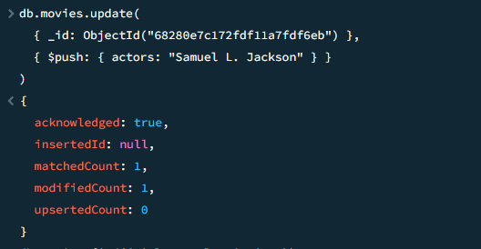

  After Update:

  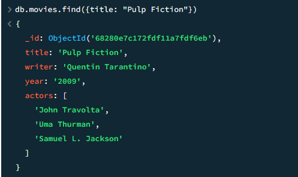

## Text Search

  1. Find all movies that have a synopsis that contains the word "Bilbo".   Code: <code>db.movies.find({synopsis:{$regex:"Bilbo"}})</code>

  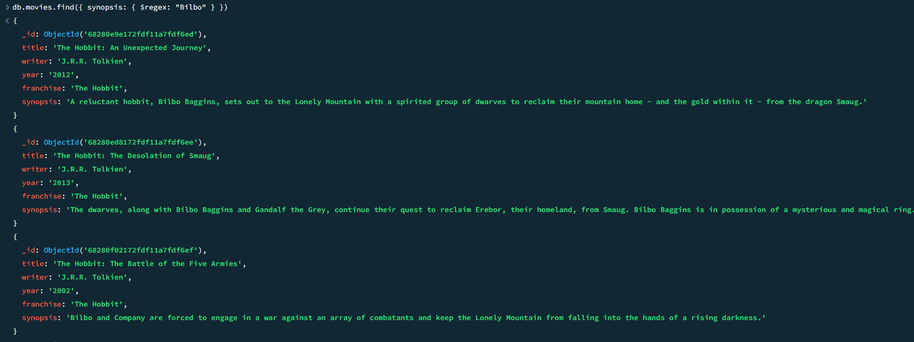

  2. Find all movies that have a synopsis that contains the word "Gandalf".   Code: <code>db.movies.find({synopsis:{$regex:"Gandalf"}})</code>

  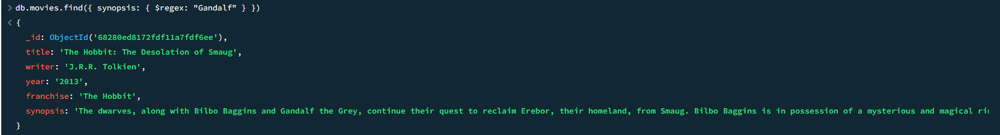

  3. Find all movies that have a synopsis that contains the word "Bilbo" and not the word "Gandalf".   Code: <code>db.movies.find({$and:[{synopsis:{$regex:"Bilbo"}}, {synopsis:{$not:/Gandalf/}}]})</code>

  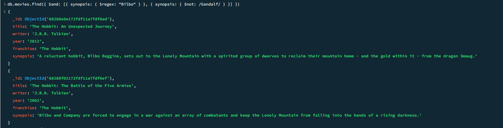

  4. Find all movies that have a synopsis that contains the word "dwarves" or "hobbit".   Code: <code>db.movies.find({$or:[{synopsis:{$regex:"dwarves"}}, {synopsis:{$regex:"hobbit"}}]})</code>

  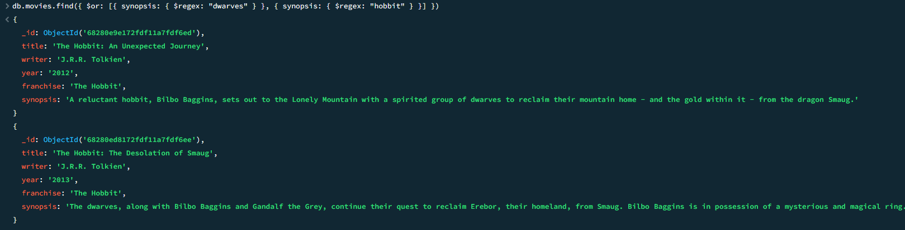

  5. Find all movies that have a synopsis that contains the word "gold" and "dragon".   Code: <code>db.movies.find({$and:[{synopsis:{$regex:"gold"}}, {synopsis:{$regex:"dragon"}}]})</code>

  

## Relationships

