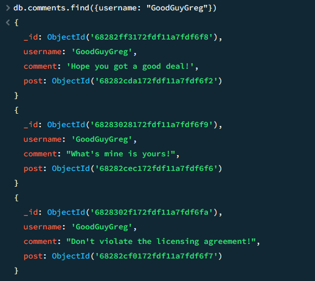

# Final Task 6 - MongoDB Practice

In this task, we used and learned the MongoDB software, following the provided step-by-step guide from our Instructor.
 

## Queries

  1. Get all documents.   Code: <code>db.movies.find()</code>

  

  2. Get all documents with "Writer" set to "Quentin Tarantino".   Code: <code>db.movies.find({writer:"Quentin Tarantino"})</code>

  

  3. Get all documents where "actor" includes Brad Pitt.   Code: <code>db.movies.find({actors:"Brad Pitt"})</code>

  

  4. Get all documents with "Franchise" set to "The Hobbit".   Code: <code>db.movies.find({franchise:"The Hobbit"})</code>

  

  5. Get all movies released in the 90s.   Code: <code>db.movies.find({year:{$gt:"1990", $lt:"2000"}})</code>

  

  6. Get all movies released before the year 2000 or after 2010.   Code: <code>db.movies.find({$or:[{year:{$gt:"2010"}},{year: {$lt:"2000"}}]})</code>

  

## Documents Update

  1. Add a synopsis to "The Hobbit An Unexpected Journey": "A reluctant hobbit, Bilbo Baggins, sets out to the Lonely Mountain with a spirited group of dwarves to reclaim their mountain home and the gold within it - from the dragon Smaug."

  Code: <code>db.movies.update({title: "The Hobbit An Unexpected Journey"}, {$set: {synopsis: "A reluctant hobbit, Bilbo Baggins, sets out to the Lonely Mountain with a spirited group of dwarves to reclaim their mountain home and the gold within it - from the dragon Smaug."}})</code>

  

  After Update:

  

  2. Add a synopsis to "The Hobbit: The Desolation of Smaug": "The dwarves, along with Bilbo Baggins and Gandalf the Grey, continue their quest to reclaim Erebor, their homeland, from Smaug. Bilbo Baggins is in possession of a mysterious and magical ring."

  Code: <code>db.movies.update({title: "The Hobbit: The Desolation of Smaug"}, {$set: {synopsis: "The dwarves, along with Bilbo Baggins and Gandalf the Grey, continue their quest to reclaim Erebor, their homeland, from Smaug. Bilbo Baggins is in possession of a mysterious and magical ring."}})</code>

  

  After Update:

  

  3. Add an actor named "Samuel L. Jackson" to the movie "Pulp Fiction"

  Code: <code>db.movies.update({title: "Pulp Fiction"}, {$push: {actors: "Samuel L. Jackson"}})</code>

  

  After Update:

  

## Text Search

  1. Find all movies that have a synopsis that contains the word "Bilbo".   Code: <code>db.movies.find({synopsis:{$regex:"Bilbo"}})</code>

  

  2. Find all movies that have a synopsis that contains the word "Gandalf".   Code: <code>db.movies.find({synopsis:{$regex:"Gandalf"}})</code>

  

  3. Find all movies that have a synopsis that contains the word "Bilbo" and not the word "Gandalf".   Code: <code>db.movies.find({$and:[{synopsis:{$regex:"Bilbo"}}, {synopsis:{$not:/Gandalf/}}]})</code>

  

  4. Find all movies that have a synopsis that contains the word "dwarves" or "hobbit".   Code: <code>db.movies.find({$or:[{synopsis:{$regex:"dwarves"}}, {synopsis:{$regex:"hobbit"}}]})</code>

  

  5. Find all movies that have a synopsis that contains the word "gold" and "dragon".   Code: <code>db.movies.find({$and:[{synopsis:{$regex:"gold"}}, {synopsis:{$regex:"dragon"}}]})</code>

  

## Deleting Documents

  1. delete the movie "Pee Wee Herman's Big Adventure".   Code: <code> db.movies.deleteOne ({_id: ObjectId('68280f11172fdf11a7fdf6f0')})</code>

  

 

2. Delete the movie "Avatar".   Code: <code> db.movies.deleteOne ({_id: ObjectId('72280f91472fdf11a0fdf6f0')}) </code>

  

## Relationships

Insert the following to <code>user</code> collection. 
Code: <code>db.users.insertMany([{ _id: 1, username: "GoodGuyGreg", first_name: "Good Guy", last_name: "Greg" }, { _id: 2, username: "ScumbagSteve", full_name: { first: "Scumbag", last: "Steve" } }])</code>

   
  After Insert Results: 
  

Insert the following documents into a <code>posts</code> collection. 
Code: <code>db.comments.insertMany([{ username: "GoodGuyGreg", comment: "Hope you got a good deal!", post: ObjectId("68282cda172fd1a7fdf6f2") }, { username: "GoodGuyGreg", comment: "What's mine is yours!", post: ObjectId("68282cec172fd1a7fdf6f6") }, { username: "GoodGuyGreg", comment: "Don't violate the licensing agreement!", post: ObjectId("68282cf0172fd1a7fdf6f7") }])</code>

   
  

Insert the following documents into a <code>comments</code> collection. 
Code:  <code>
db.comments.insert({username:"GoodGuyGreg", comment:"Hope you got a good deal!", post:ObjectId("5ca0b7e96435f98b5901f463")}); 
db.comments.insert({username:"GoodGuyGreg", comment:"What's mine is yours!", post:ObjectId("5ca0b9706435f98b5901f46a")}); 
db.comments.insert({username:"GoodGuyGreg", comment:"Don't violate the licensing agreement!", post:ObjectId("5ca0b8766435f98b5901f467")}); 
db.comments.insert({username:"ScumbagSteve", comment:"It still isn't clean", post:ObjectId("5ca0b8546435f98b5901f466")}); 
db.comments.insert({username:"ScumbagSteve", comment:"Denied your PR cause I found a hack", post:ObjectId("5ca0b9256435f98b5901f469")});
</code>

   
    
  Relational Afterwards: 
  

## Query

<strong>1. Find all users</strong>  
<code>db.users.find().pretty()</code>  

<strong>2. Find all posts</strong>  
<code>db.posts.find().pretty()</code>  

<strong>3. Find all posts authored by "GoodGuyGreg"</strong>  
<code>db.posts.find({username: "GoodGuyGreg"})</code>  

<strong>4. Find all posts authored by "ScumbagSteve"</strong>  
<code>db.posts.find({username: "ScumbagSteve"})</code>  

<strong>5. Find all comments</strong>  
<code>db.comments.find().pretty()</code>  

<strong>6. Find all comments authored by "GoodGuyGreg"</strong>  
<code>db.comments.find({username: "GoodGuyGreg"})</code>  

<strong>7. Find all comments authored by "ScumbagSteve"</strong>  
<code>db.comments.find({username: "ScumbagSteve"})</code>  

<strong>8. Find all comments belonging to the post "Reports a bug in your code"</strong>  
<code>db.comments.find({post: ObjectId("682862155750a49fa77b8e7b")})</code>  

